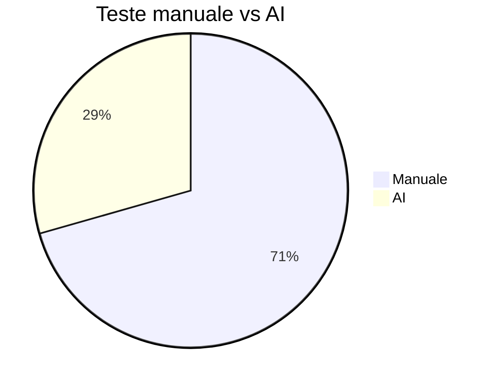

# TSS_2026

## Tema proiectului
Tema: T3 Testare unitara in Java.

Obiectivul acestui proiect este sa arate utilizarea unui framework Java de testare unitara pentru o componenta de clasificare triunghiuri, completata cu strategii de testare avansate, masuratori de acoperire si analiza mutantilor.

Proiectul extinde o tema simpla prin:
- clasificarea tipului de triunghi (`EQUILATERAL`, `ISOSCELES`, `SCALENE`, `RIGHT_SCALENE`, `INVALID`)
- clasificarea unghiului (`ACUTE`, `RIGHT`, `OBTUSE`, `INVALID`)
- calculul ariei, perimetrului, semiperimetrului si inaltimii
- teste manuale si teste AI comparative
- masurare acoperire cu JaCoCo si analiza mutantilor cu PIT

## Structura proiectului
- `pom.xml` - configuratie Maven pentru compilare, teste, JaCoCo si PIT
- `src/main/java/ro/edu/fmi/tss` - cod sursa aplicatie
- `src/test/java/ro/edu/fmi/tss` - teste unitare manuale si AI
- `docs/` - documentatie, raport AI, prezentare, plan proiect si diagrame

## Tema schimbata si dezvoltata
Tema initiala era una simpla de clasificare triunghiuri. Am extins-o pentru a arata fundamentele testarii unitare:
- definirea claselor de echivalenta
- analiza valorilor de frontiera
- acoperire la nivel de instructiune, decizie si conditie
- comparatie intre teste manuale si teste generate de AI
- modificari in cod si teste pentru a imbunatati UCIDEREA mutantilor

## Strategii de testare aplicate
1. Partitionare in clase de echivalenta:
   - triunghi invalid
   - triunghi echilateral
   - triunghi isoscel
   - triunghi scalene
   - triunghi dreptunghic
2. Analiza valorilor de frontiera:
   - laturi 0 si negative: `(0,5,5)`, `(-1,4,4)`
   - laturi care incalca inegalitatea triunghi: `(1,2,10)`, `(2,3,5)`
   - triunghiuri limite: `(1,1,1)`, `(3,4,5)`
3. Acoperire la nivel de decizie si conditie:
   - `INVALID`
   - `EQUILATERAL`
   - `RIGHT_SCALENE`
   - `ISOSCELES`
   - `SCALENE`
   - `ACUTE`, `RIGHT`, `OBTUSE`
4. Analiza circuitelor independente: testarea ramurilor `isRightTriangle`, `isObtuseTriangle`, `isAcuteTriangle`, `height` si `semiperimeter`
5. Analiza mutantilor:
   - `CONDITIONALS_BOUNDARY`
   - `NEGATE_CONDITIONALS`
   - `VOID_METHOD_CALLS`
   - `INVERT_NEGS`

## Comparatie teste manuale vs AI
- `TriangleClassifierTest.java`: teste manuale cu strategii explicite, valori de frontiera si valori de echivalenta
- `TriangleClassifierAIGeneratedTest.java`: teste generate de AI pentru verificari functionale rapide

| Criteriu | Teste manuale | Teste AI |
|---|---|---|
| Clasa de echivalenta | Da | Partial |
| Frontiera | Da | Nu complet |
| Acoperire decizie | Da | Functionala de baza |
| Detectie mutanti | Mai buna | Limitata |
| Scop | Validare robusta | prototip rapid |

## Cum se ruleaza
1. Instalati Java 17 si Maven 3.8+
2. Din directorul proiectului rulati:
   - `mvn clean test` - ruleaza toate testele si genereaza raport JaCoCo
   - `mvn test jacoco:report` - produce raportul HTML de acoperire
   - `mvn org.pitest:pitest-maven:mutationCoverage` - ruleaza analiza mutantilor

## Rezultate curente
- **Teste unitare totale**: 17
- **Teste manuale**: 12
- **Teste AI**: 5
- **Status**: toate testele trec ✅
- **Acoperire JaCoCo**: 87%
- **Mutation score PIT**: 87%
- **PIT line coverage**: 95%

## Comparatie rezultate
| Metric | Manual | AI | Observatie |
|---|---|---|---|
| Nr. teste | 12 | 5 | Manual include scenarii de frontieră și decizii multiple |
| Acoperire funcțională | ridicată | de bază | AI a propus cazuri utile, dar nu complete |
| Acoperire mutantilor | 87% | contribuie în total | teste manuale au ucis mutanți suplimentari |
| Tipuri acoperite | clasa echivalență, frontiera, condiție | validare funcțională | manual adaugă verificări geometry helper methods |

## Grafic comparatie


## Prompt folosit cu AI
Am folosit urmatorul prompt ca punct de plecare pentru generarea și îmbunătățirea testelor:

```
Please inspect the Java triangle classifier repository structure and generate JUnit 5 tests for TriangleClassifier. Include manual-style boundary cases, equivalence classes, angle classification, invalid triangles, unsorted side order, and helper methods such as area, perimeter, semiperimeter, and height. Compare AI-generated tests with manual tests and point out where we need to add coverage to kill mutation testing mutants.
```

## Ce am documentat
- testele manuale și cele AI
- strategii de testare aplicate: echivalență, frontiere, condiții, circuite independente
- comenzi de rulare și rapoarte generate
- rezultate numerice și observații comparative

## Rapoarte generate
- `target/site/jacoco/index.html` - raport acoperire cod
- `target/pit-reports/index.html` - raport analiza mutantilor
- `target/surefire-reports/` - rapoarte rezultate teste

## Diagrama si capturi ecran
- `docs/diagrams/triangle-classification.drawio` - diagrama fluxului de clasificare si testare
- `docs/screenshots/Test1_jacoco.png` - captură ecran raport JaCoCo (set 1)
- `docs/screenshots/Test1_pit.png` - captură ecran raport PIT (set 1)
- `docs/screenshots/Test2_jacoco.png` - captură ecran raport JaCoCo (set 2)
- `docs/screenshots/Test2_pit.png` - captură ecran raport PIT (set 2)


## Ce am facut in plus
- am extins tema pentru a include clasificare unghi și calcule geometrice
- am adăugat teste boundary suplimentare pentru a crește puterea mutant testing
- am introdus o comparație manual vs AI și am documentat promptul AI
- am actualizat README-ul cu rezultate reale și grafice comparative

## Referinte
- JUnit 5: https://junit.org/junit5/
- JaCoCo: https://www.jacoco.org/
- PIT: https://pitest.org/
- GitHub Copilot: https://github.com/features/copilot
