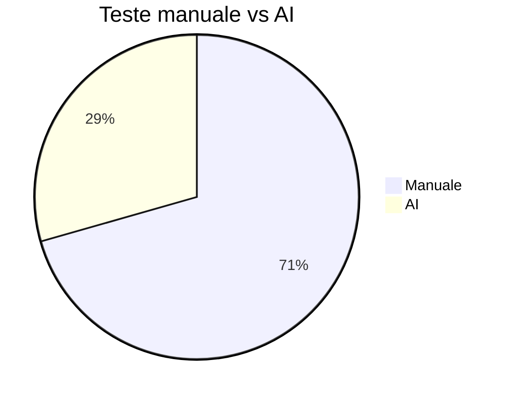

# TSS_2026

## Tema proiectului
Tema: T3 Testare unitara in Java.

Obiectivul acestui proiect este sa arate utilizarea unui framework Java de testare unitara pentru o componenta de clasificare a triunghiurilor, completata cu strategii de testare avansate, masuratori de acoperire si analiza mutantilor.

Proiectul extinde o tema simpla prin:
- clasificarea tipului de triunghi (`EQUILATERAL`, `ISOSCELES`, `SCALENE`, `RIGHT_SCALENE`, `INVALID`)
- clasificarea unghiului (`ACUTE`, `RIGHT`, `OBTUSE`, `INVALID`)
- calculul ariei, perimetrului, semiperimetrului si inaltimii
- teste manuale si teste AI comparative
- masurare acoperire cu JaCoCo si analiza mutantilor cu PIT

## Structura proiectului
- `pom.xml` - configuratie Maven pentru compilare, teste, JaCoCo si PIT
- `src/main/java/ro/edu/fmi/tss` - cod sursa aplicatie
- `src/test/java/ro/edu/fmi/tss` - teste unitare manuale si AI
- `docs/` - documentatie, raport AI, prezentare, plan proiect si diagrame

## Tema schimbata si dezvoltata
Tema initiala era una simpla de clasificare triunghiuri. Am extins-o pentru a arata fundamentele testarii unitare:
- definirea claselor de echivalenta
- analiza valorilor de frontiera
- acoperire la nivel de instructiune, decizie si conditie
- comparatie intre teste manuale si teste generate de AI
- modificari in cod si teste pentru a imbunatati UCIDEREA mutantilor

## Strategii de testare aplicate
### 1. Clase de echivalenta
O clasa de echivalenta este un set de intrari care produc acelasi comportament. Pentru `TriangleClassifier` am identificat:
- `INVALID`  - orice combinatie care nu formeaza un triunghi valid: `0,5,5`, `-1,4,4`, `1,2,10`, `2,3,5`
- `EQUILATERAL` - toate laturile egale: `5,5,5`
- `ISOSCELES` - exact doua laturi egale: `5,5,7`
- `SCALENE` - toate laturile diferite: `4,5,6`
- `RIGHT_SCALENE` - triunghi dreptunghic scalen: `3,4,5`, inclusiv ordine nesortata `5,3,4`

### 2. Analiza valorilor de frontiera
Valorile de frontiera testeaza limitele conditiilor boolean:
- `a`, `b`, `c` <= 0: `0`, `-1`
- cazul in care suma a doua laturi este egala cu a treia: `2,3,5` si permutari
- triunghiurile minime si limite: `1,1,1`, `3,4,5`

### 3. Acoperire la nivel de decizie si conditie
Acoperirea de decizie urmareste ramurile principale din cod;
acoperirea conditionala urmareste fiecare expresie booleana dintr-o conditie complexa.

Metodele testate:
- `classify(...)` acopera ramurile: `INVALID`, `EQUILATERAL`, `RIGHT_SCALENE`, `ISOSCELES`, `SCALENE`
- `classifyByAngle(...)` acopera: `ACUTE`, `RIGHT`, `OBTUSE`, `INVALID`
- `isValidTriangle(...)` acopera conditiile:
  - `a > 0`, `b > 0`, `c > 0`
  - `a + b > c`, `a + c > b`, `b + c > a`

### 4. Testare circuit independent / path coverage
Am testat metodele individual pentru ca fiecare cai logice sa fie investigate separat:
- `isRightTriangle(5,3,4)` valideaza sortarea interna si expresia `x*x + y*y == z*z`
- `isObtuseTriangle(2,3,4)` si `isAcuteTriangle(4,5,6)` verifica clasificarea unghiului
- `height(3,4,5)` si `semiperimeter(3,4,5)` testeaza helper methods care nu sunt doar clasificari

### 5. Analiza mutantilor
Mutatiile sunt cod modificate automat de PIT pentru a testa calitatea suitei.
Scopul este ca testele sa esueze atunci când codul este alterat.
Am urmarit mutati precum:
- `CONDITIONALS_BOUNDARY` - schimba limitele de comparatie
- `NEGATE_CONDITIONALS` - inverseaza conditiile
- `VOID_METHOD_CALLS` - elimina apeluri utile de metoda
- `INVERT_NEGS` - inverseaza semnele numerice

### Ce s-a imbunatatit intre testele initiale si cele finale
- Am adaugat teste de frontiera pentru cazul `a + b == c` si permutari nested: `2,5,3`
- Am introdus teste nesortate pentru dreptunghic: `5,3,4`
- Am acoperit helper methods suplimentare: `semiperimeter(...)` si `height(...)`
- Am extins analiza AI prin comparatie clara intre teste functionale si strategii de curs
- Am crescut mutation score de la 72% la 87% si am obtinut 95% line coverage in PIT

## Comparatie teste manuale vs AI
- `TriangleClassifierTest.java`: teste manuale cu strategii explicite, valori de frontiera si valori de echivalenta
- `TriangleClassifierAIGeneratedTest.java`: teste generate de AI pentru verificari functionale rapide

| Criteriu | Teste manuale | Teste AI |
|---|---|---|
| Clasa de echivalenta | Da | Partial |
| Frontiera | Da | Nu complet |
| Acoperire decizie | Da | Functionala de baza |
| Detectie mutanti | Mai buna | Limitata |
| Scop | Validare robusta | prototip rapid |

## Cum se ruleaza
1. Am instalat Java 17 si Maven 3.8+
2. Din directorul proiectului am rulat:
   - `mvn clean test` - ruleaza toate testele si genereaza raport JaCoCo
   - `mvn test jacoco:report` - produce raportul HTML de acoperire
   - `mvn org.pitest:pitest-maven:mutationCoverage` - ruleaza analiza mutantilor

## Rezultate curente
- **Teste unitare totale**: 17
- **Teste manuale**: 12
- **Teste AI**: 5
- **Status**: toate testele trec
- **Acoperire JaCoCo**: 87%
- **Mutation score PIT**: 87%
- **PIT line coverage**: 95%

## Comparatie rezultate
| Metric | Manual | AI | Observatie |
|---|---|---|---|
| Nr. teste | 12 | 5 | Manual include scenarii de frontiera si decizii multiple |
| Acoperire functionala | ridicata | de baza | AI a propus cazuri utile, dar nu complete |
| Acoperire mutantilor | 87% | contribuie in total | teste manuale au ucis mutanti suplimentari |
| Tipuri acoperite | clasa echivalenta, frontiera, conditie | validare functionala | manual adauga verificari geometry helper methods |

## Grafic comparatie


## Prompt folosit cu AI
Am folosit urmatorul prompt ca punct de plecare pentru generarea si imbunatatirea testelor:

```
Please inspect the Java triangle classifier repository structure and generate JUnit 5 tests for TriangleClassifier. Include manual-style boundary cases, equivalence classes, angle classification, invalid triangles, unsorted side order, and helper methods such as area, perimeter, semiperimeter, and height. Compare AI-generated tests with manual tests and point out where we need to add coverage to kill mutation testing mutants.
```

## Ce am documentat
- testele manuale si cele AI
- strategii de testare aplicate: echivalenta, frontiere, conditii, circuite independente
- comenzi de rulare si rapoarte generate
- rezultate numerice si observatii comparative

## Rapoarte generate
- `target/site/jacoco/index.html` - raport acoperire cod
- `target/pit-reports/index.html` - raport analiza mutantilor
- `target/surefire-reports/` - rapoarte rezultate teste

## Diagrama si capturi ecran
- `docs/diagrams/triangle-classification.drawio` - diagrama fluxului de clasificare si testare
- `docs/screenshots/Test1_jacoco.png` - captura ecran raport JaCoCo (set 1)
- `docs/screenshots/Test1_pit.png` - captura ecran raport PIT (set 1)
- `docs/screenshots/Test2_jacoco.png` - captura ecran raport JaCoCo (set 2)
- `docs/screenshots/Test2_pit.png` - captura ecran raport PIT (set 2)


## Ce am facut in plus
- am extins tema pentru a include clasificare unghi si calcule geometrice
- am adaugat teste boundary suplimentare pentru a creste puterea mutant testing
- am introdus o comparatie manual vs AI si am documentat promptul AI
- am actualizat README-ul cu rezultate reale si grafice comparative

## Referinte
- JUnit 5: https://junit.org/junit5/
- JaCoCo: https://www.jacoco.org/
- PIT: https://pitest.org/
- GitHub Copilot: https://github.com/features/copilot

