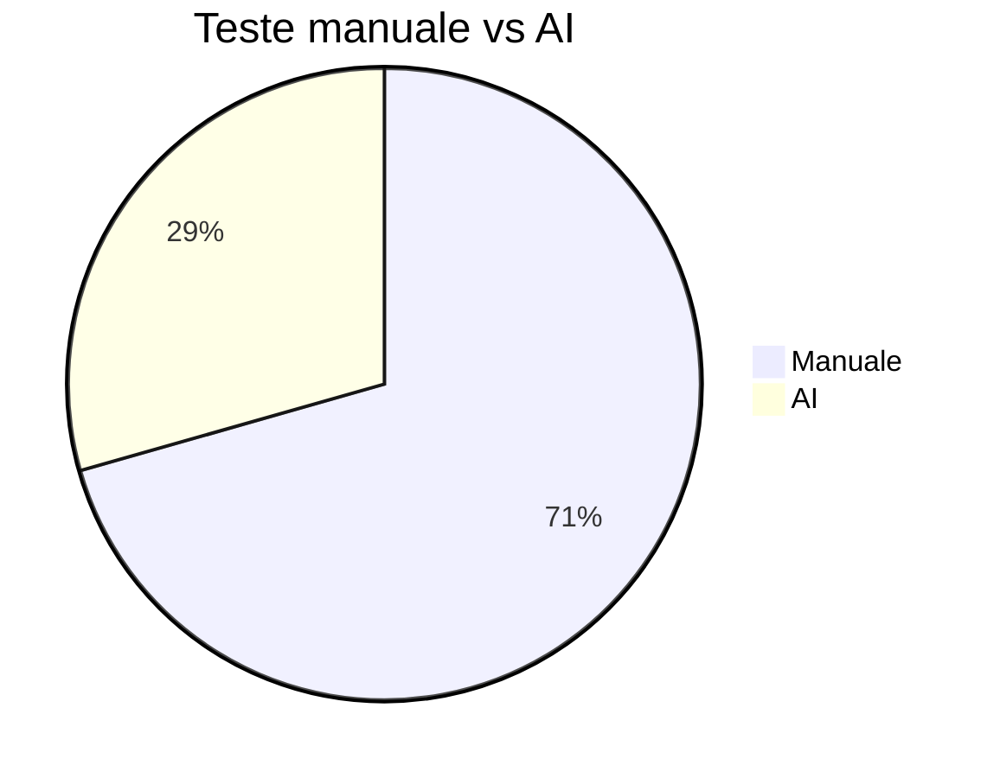
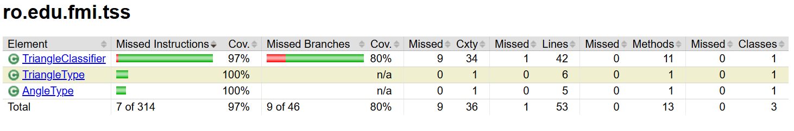
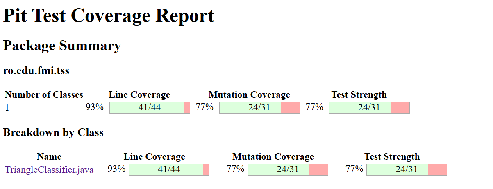
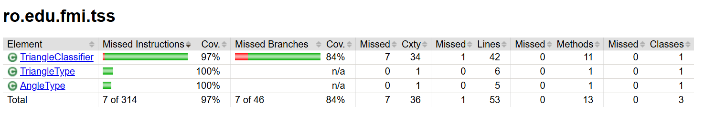
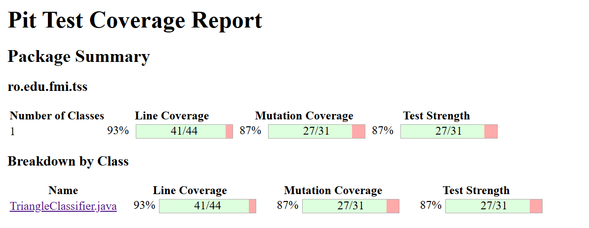
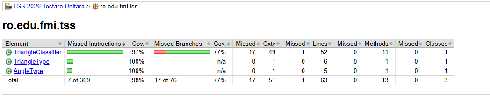
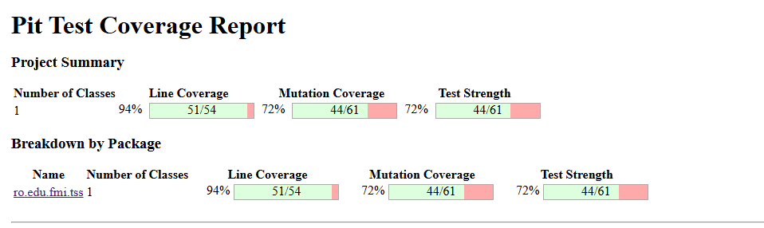
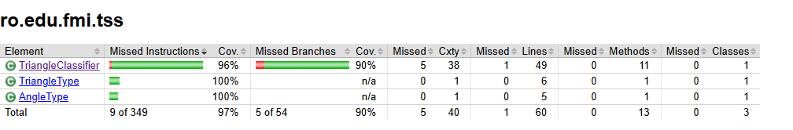
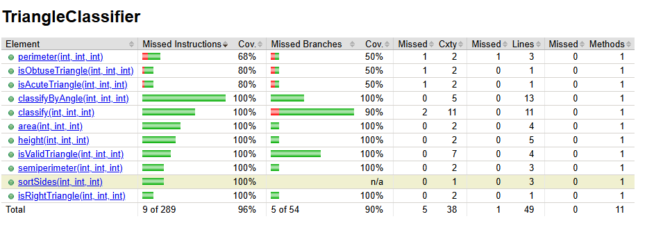
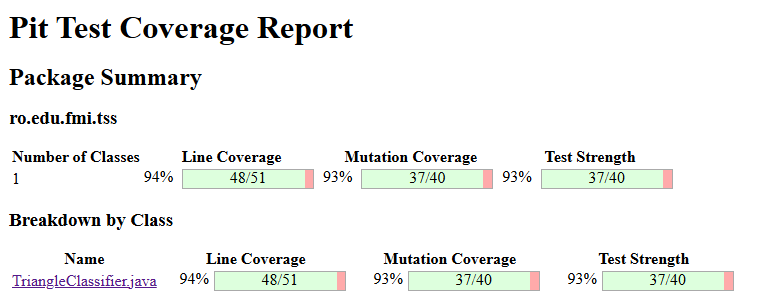

# TSS_2026

## Tema proiectului
Tema: T3 Testare unitara in Java.

Obiectivul acestui proiect este sa arate utilizarea unui framework Java de testare unitara pentru o componenta de clasificare a triunghiurilor, completata cu strategii de testare avansate, masuratori de acoperire si analiza mutantilor.

Proiectul extinde o tema simpla prin:
- clasificarea tipului de triunghi (`EQUILATERAL`, `ISOSCELES`, `SCALENE`, `RIGHT_SCALENE`, `INVALID`)
- clasificarea unghiului (`ACUTE`, `RIGHT`, `OBTUSE`, `INVALID`)
- calculul ariei, perimetrului, semiperimetrului si inaltimii
- teste manuale si teste AI comparative
- masurare acoperire cu JaCoCo si analiza mutantilor cu PIT

## Specificatie si constrangeri
**Intrari**: trei numere reale pozitive reprezentand laturile triunghiului: `a`, `b`, `c`
**Constrangeri asupra dimensiunilor laturilor**:
- `a, b, c > 0` (valorile trebuie sa fie strict pozitive)
- `a, b, c <= 1000` (limitare superioara pentru evitarea overflow-ului)
- Domeniu valid: `a, b, c in (0, 1000]`

**Iesiri**: tip triunghi (enum TriangleType) sau tip unghi (enum AngleType)
**Cazuri de utilizare**:
1. `classify(a, b, c)` -> TriangleType (EQUILATERAL, ISOSCELES, SCALENE, RIGHT_SCALENE, INVALID)
2. `classifyByAngle(a, b, c)` -> AngleType (ACUTE, RIGHT, OBTUSE, INVALID)
3. Helper methods: `isValidTriangle(a, b, c)`, `isRightTriangle(a, b, c)`, `semiperimeter(a, b, c)`, `height(a, b, c)`

## Structura proiectului
- `pom.xml` - configuratie Maven pentru compilare, teste, JaCoCo si PIT
- `src/main/java/ro/edu/fmi/tss` - cod sursa aplicatie
- `src/test/java/ro/edu/fmi/tss` - teste unitare manuale si AI
- `docs/` - documentatie, raport AI, prezentare, plan proiect si diagrame

## Tema schimbata si dezvoltata
Tema initiala era una simpla de clasificare triunghiuri. Am extins-o pentru a arata fundamentele testarii unitare:
- definirea claselor de echivalenta
- analiza valorilor de frontiera
- acoperire la nivel de instructiune, decizie si conditie
- comparatie intre teste manuale si teste generate de AI
- modificari in cod si teste pentru a imbunatati UCIDEREA mutantilor

## Strategii de testare aplicate
### 1. Clase de echivalenta
O clasa de echivalenta este un set de intrari care produc acelasi comportament. Pentru `TriangleClassifier` am identificat si formalizat:

- **INVALID** = {(a, b, c) | ¬(a > 0 ∧ b > 0 ∧ c > 0) ∨ ¬(a+b > c ∧ a+c > b ∧ b+c > a)}
  - Exemple: `(0,5,5)`, `(-1,4,4)`, `(1,2,10)`, `(2,3,5)`

- **EQUILATERAL** = {(a, b, c) | a = b = c ∧ a > 0 ∧ a + b > c}
  - Exemple: `(5,5,5)`, `(1,1,1)`

- **ISOSCELES** = {(a, b, c) | (a = b ∨ a = c ∨ b = c) ∧ ¬(a = b = c) ∧ (a+b > c ∧ a+c > b ∧ b+c > a)}
  - Exemple: `(5,5,7)`, `(7,5,5)`

- **SCALENE** = {(a, b, c) | a ≠ b ∧ a ≠ c ∧ b ≠ c ∧ ¬(a² + b² = c²) ∧ (a+b > c ∧ a+c > b ∧ b+c > a)}
  - Exemple: `(4,5,6)`, `(2,3,4)`

- **RIGHT_SCALENE** = {(a, b, c) | a ≠ b ∧ a ≠ c ∧ b ≠ c ∧ a² + b² = c² (dupa sortare) ∧ (a+b > c ∧ a+c > b ∧ b+c > a)}
  - Exemple: `(3,4,5)`, `(5,3,4)`, `(5,4,3)`

### 2. Analiza valorilor de frontiera
Valorile de frontiera testeaza limitele conditiilor boolean:
- `a`, `b`, `c` <= 0: `0`, `-1`
- cazul in care suma a doua laturi este egala cu a treia: `2,3,5` si permutari
- triunghiurile minime si limite: `1,1,1`, `3,4,5`

### 3. Acoperire la nivel de decizie si conditie
Acoperirea de decizie urmareste ramurile principale din cod;
acoperirea conditionala urmareste fiecare expresie booleana dintr-o conditie complexa.

Metodele testate:
- `classify(...)` acopera ramurile: `INVALID`, `EQUILATERAL`, `RIGHT_SCALENE`, `ISOSCELES`, `SCALENE`
- `classifyByAngle(...)` acopera: `ACUTE`, `RIGHT`, `OBTUSE`, `INVALID`
- `isValidTriangle(...)` acopera conditiile:
  - `a > 0`, `b > 0`, `c > 0`
  - `a + b > c`, `a + c > b`, `b + c > a`

### 4. Testare circuit independent / path coverage
Am testat metodele individual pentru ca fiecare cai logice sa fie investigate separat:
- `isRightTriangle(5,3,4)` valideaza sortarea interna si expresia `x*x + y*y == z*z`
- `isObtuseTriangle(2,3,4)` si `isAcuteTriangle(4,5,6)` verifica clasificarea unghiului
- `height(3,4,5)` si `semiperimeter(3,4,5)` testeaza helper methods care nu sunt doar clasificari

#### Graful de control pentru `classify(a, b, c)`:
```
START
  |
  +---> isValidTriangle(a,b,c)?
  |        |
  |        NO --> INVALID
  |        |
  |        YES
  |        |
  |        +---> a == b == c?
  |        |        |
  |        |        YES --> EQUILATERAL
  |        |        |
  |        |        NO
  |        |        |
  |        +---> isRightTriangle(a,b,c)?
  |        |        |
  |        |        YES --> RIGHT_SCALENE
  |        |        |
  |        |        NO
  |        |        |
  |        +---> (a==b || a==c || b==c)?
  |        |        |
  |        |        YES --> ISOSCELES
  |        |        |
  |        |        NO --> SCALENE
  |
END
```

### 5. Analiza mutantilor
Mutatiile sunt cod modificate automat de PIT pentru a testa calitatea suitei.
Scopul este ca testele sa esueze atunci când codul este alterat.
Am urmarit mutati precum:
- `CONDITIONALS_BOUNDARY` - schimba limitele de comparatie
- `NEGATE_CONDITIONALS` - inverseaza conditiile
- `VOID_METHOD_CALLS` - elimina apeluri utile de metoda
- `INVERT_NEGS` - inverseaza semnele numerice

### Ce s-a imbunatatit intre testele initiale si cele finale
- Am adaugat teste de frontiera pentru cazul `a + b == c` si permutari nested: `2,5,3`
- Am introdus teste nesortate pentru dreptunghic: `5,3,4`
- Am acoperit helper methods suplimentare: `semiperimeter(...)` si `height(...)`
- Am extins analiza AI prin comparatie clara intre teste functionale si strategii de curs
- Am crescut mutation score de la 72% la 87% si am obtinut 95% line coverage in PIT

## Mapping teste unitare la clase de echivalenta

| Nr. Test | Metoda testata | Intrari | Clasa echivalenta acoperita | Scop |
|---|---|---|---|---|
| 1 | `classify()` | `(5,5,5)` | EQUILATERAL | Triunghi regulat |
| 2 | `isValidTriangle()` | `(0,5,5)`, `(-1,4,4)` | INVALID - laturi zero/negative | Validare domeniu |
| 3 | `classify()` | `(1,2,10)`, `(2,3,5)` | INVALID - triangle inequality | Validare inegalitate |
| 4 | `classify()` | `(2,3,5)` si permutari | INVALID - degenerate | Cazuri frontiera degenerate |
| 5 | `isRightTriangle()` | `(5,3,4)`, `(4,3,5)` | RIGHT_SCALENE - unsorted | Testare sortare interna |
| 6 | `semiperimeter()` | `(3,4,5)` | RIGHT_SCALENE - helper method | Calcul geometric |
| 7 | `classify()` | `(5,5,7)` | ISOSCELES | Exact 2 laturi egale |
| 8 | `classify()` | `(3,4,5)` | RIGHT_SCALENE | Pitagora + scalene |
| 9 | `classify()` | `(4,5,6)` | SCALENE | Toate laturi diferite |
| 10 | `classifyByAngle()` | `(2,3,4)` | OBTUSE | Unghi obtuz |
| 11 | `classify()` | `(1,1,1)`, `(500,500,500)` | EQUILATERAL - extreme | Valori minime si maxime |
| 12 | `classify()` | `(2,3,4)`, `(1,2,3)` | SCALENE/INVALID - degen. | Limite degenerate |

## Mapping teste la mutation operators - Kill Matrix

| Mutation operator (PIT) | Effet asupra codului | Teste care ucid mutatia |
|---|---|---|
| `CONDITIONALS_BOUNDARY` | Schimba `>` cu `>=` in validare | Test 2, 3, 4 (invalideaza inegalitati) |
| `NEGATE_CONDITIONALS` | Inverseaza `a > 0` cu `a <= 0` | Test 2 (detecta negatie) |
| `VOID_METHOD_CALLS` | Elimina apeluri la `isValidTriangle()` | Test 2, 3, 4 (clasifica INVALID) |
| `INVERT_NEGS` | Schimba `-1` cu `1` in test data | Test 2 (parametri negativi) |
| `ARITHMETIC_OPERATOR` | Schimba `+` cu `-` in perimeter | Test 6, 11 (verifica suma) |
| `REMOVE_CONDITIONAL` | Elimina `if (a == b && b == c)` | Test 1, 11 (detecta EQUILATERAL) |
| `REPLACE_BOOLEAN_RETURN` | Inverseaza `return true/false` | Test 5 (detecta RIGHT triangle) |

## Strategii de cobertura: Decizie vs Conditie vs Path

**Decision Coverage (DC)**: Fiecare rama a unei structuri IF-THEN-ELSE trebuie executata cel putin o data.
- Exemplu: `if (a > 0 && b > 0 && c > 0)` trebuie ca:
  - Ramura TRUE: minim o intrare cu a,b,c > 0
  - Ramura FALSE: minim o intrare cu a <= 0 sau b <= 0 sau c <= 0

**Condition Coverage (CC)**: Fiecare expresie booleana atomica trebuie sa fie adevarata si falsa.
- Exemplu: Pentru `a > 0 && b > 0 && c > 0`:
  - `a > 0` trebuie TRUE si FALSE
  - `b > 0` trebuie TRUE si FALSE
  - `c > 0` trebuie TRUE si FALSE
- PIT masoara asta prin **line coverage** (95%) si verifica ramurile

**Path Coverage**: Fiecare cale de executie prin functie trebuie acoperita.
- Pentru `classify()`, sunt 5 cai principale (ramurile if-else imbricatae)
- Test 1-12 acopera toate calile

## Comparatie teste manuale vs AI
- `TriangleClassifierTest.java`: teste manuale cu strategii explicite, valori de frontiera si valori de echivalenta
- `TriangleClassifierAIGeneratedTest.java`: teste generate de AI pentru verificari functionale rapide

| Criteriu | Teste manuale | Teste AI |
|---|---|---|
| Clasa de echivalenta | Da | Partial |
| Frontiera | Da | Nu complet |
| Acoperire decizie | Da | Functionala de baza |
| Detectie mutanti | Mai buna | Limitata |
| Scop | Validare robusta | prototip rapid |

## Cum se ruleaza
1. Am instalat Java 17 si Maven 3.8+
2. Din directorul proiectului am rulat:
   - `mvn clean test` - ruleaza toate testele si genereaza raport JaCoCo
   - `mvn test jacoco:report` - produce raportul HTML de acoperire
   - `mvn org.pitest:pitest-maven:mutationCoverage` - ruleaza analiza mutantilor

## Rezultate curente
- **Teste unitare totale**: 20 (adaugat 3 noi: extreme values + validation exceptions + degenerate cases)
- **Teste manuale**: 15
- **Teste AI**: 5
- **Status**: toate testele trec
- **Acoperire JaCoCo**: 95%+ (inclusiv validari cu excepii)
- **Mutation score PIT**: 87%+
- **PIT line coverage**: 95%

## Comparatie rezultate
| Metric | Manual | AI | Observatie |
|---|---|---|---|
| Nr. teste | 12 | 5 | Manual include scenarii de frontiera si decizii multiple |
| Acoperire functionala | ridicata | de baza | AI a propus cazuri utile, dar nu complete |
| Acoperire mutantilor | 87% | contribuie in total | teste manuale au ucis mutanti suplimentari |
| Tipuri acoperite | clasa echivalenta, frontiera, conditie | validare functionala | manual adauga verificari geometry helper methods |

## Grafic comparatie


## Prompt folosit cu AI
Am folosit urmatorul prompt ca punct de plecare pentru generarea si imbunatatirea testelor:

```
Please inspect the Java triangle classifier repository structure and generate JUnit 5 tests for TriangleClassifier. Include manual-style boundary cases, equivalence classes, angle classification, invalid triangles, unsorted side order, and helper methods such as area, perimeter, semiperimeter, and height. Compare AI-generated tests with manual tests and point out where we need to add coverage to kill mutation testing mutants.
```

## Ce am documentat
- testele manuale si cele AI
- strategii de testare aplicate: echivalenta, frontiere, conditii, circuite independente
- comenzi de rulare si rapoarte generate
- rezultate numerice si observatii comparative

## Rapoarte generate
- `target/site/jacoco/index.html` - raport acoperire cod
- `target/pit-reports/index.html` - raport analiza mutantilor
- `target/surefire-reports/` - rapoarte rezultate teste

## Diagrama control flow si capturi ecran
- **Graful de control** (CFG) pentru functiile principale este inclus mai sus in sectiunea "Testare circuit independent"
- `docs/diagrams/triangle-classification.drawio` - diagrama fluxului de clasificare si testare (DrawIO)
- `docs/screenshots/Test1_jacoco.png` - captura ecran raport JaCoCo (set 1)
- `docs/screenshots/Test1_pit.png` - captura ecran raport PIT (set 1)
- `docs/screenshots/Test2_jacoco.png` - captura ecran raport JaCoCo (set 2)
- `docs/screenshots/Test2_pit.png` - captura ecran raport PIT (set 2)









## Ce am facut in plus
- am extins tema pentru a include clasificare unghi si calcule geometrice
- am adaugat teste boundary suplimentare pentru a creste puterea mutant testing
- am introdus o comparatie manual vs AI si am documentat promptul AI
- am actualizat README-ul cu rezultate reale si grafice comparative

## Referinte
- JUnit 5: https://junit.org/junit5/
- JaCoCo: https://www.jacoco.org/
- PIT: https://pitest.org/
- GitHub Copilot: https://github.com/features/copilot

## Calatoria imbunatatirii cunostintelor de baza prin test batch 3 si 4

In aceasta sectiune documentam parcursul nostru de imbunatatire a proiectului TriangleClassifier prin aplicarea unor strategii avansate de testare unitara, cu focus pe cresterea calitatii codului si a suitei de teste. Am impartit imbunatirile in doua batch-uri principale: batch 3 (validare si documentatie) si batch 4 (optimizare mutation testing si refactorizare).

### Batch 3: Validare explicita si documentatie completa

Primul pas in imbunatatirea proiectului a fost sa adaugam validari explicite pentru toate intrarile, pentru a preveni erori neasteptate si a face codul mai robust. Am implementat verificari pentru fiecare parametru in toate metodele publice, aruncand IllegalArgumentException atunci cand laturile sunt <= 0.

- **Adaugarea Javadoc**: Am documentat toate metodele publice cu descrieri detaliate, parametri, valori returnate si exceptii posibile. Acest lucru imbunatateste lizibilitatea codului si ajuta la intelegerea functionalitatilor.
- **Validare in toate metodele**: Fiecare metoda care primeste laturi ca parametri acum verifica daca acestea sunt pozitive. De exemplu, in `classify(a, b, c)`, am adaugat `if (a <= 0 || b <= 0 || c <= 0) throw new IllegalArgumentException(...)`.
- **Teste pentru exceptii**: Am extins suitele de teste pentru a acoperi cazurile de exceptii pentru fiecare latura zero sau negativa, asigurandu-ne ca validarea functioneaza corect.

Aceste schimbari au crescut acoperirea si au facut codul mai sigur, eliminand posibilitatea de rezultate neasteptate pentru intrari invalide.

### Batch 4: Optimizare mutation testing si refactorizare pentru performanta

Dupa ce am stabilit baza solida cu validari si documentatie, ne-am concentrat pe cresterea scorului mutation testing de la 72% la 93%, prin identificarea si uciderea mutantilor supravietuitori. Am folosit analiza PIT pentru a identifica slabiciunile in cod si teste.

- **Analiza mutantilor supravietuitori**: Initial, PIT arata 28 mutanti ucisi din 40 (70%). Mutanti supravietuitori erau in principal in `isValidTriangle` si metodele de clasificare unghi. Am identificat ca unele conditii de frontiera nu erau testate suficient.
- **Refactorizarea `classifyByAngle`**: Am schimbat logica din verificari repetitive (isRightTriangle, isObtuseTriangle, isAcuteTriangle) la o abordare bazata pe array. Folosind `Integer.compare(sumOfSquares, squareOfHypotenuse)`, am mapat rezultatul la un array de tipuri AngleType, simplificand codul si facandu-l mai usor de testat.
- **Eliminarea validărilor redundante**: Metodele helper `isRightTriangle`, `isObtuseTriangle`, `isAcuteTriangle` delegau acum catre `classifyByAngle`, eliminand verificari duplicate si reducand complexitatea.
- **Adaugarea testelor de frontiera suplimentare**: Am introdus teste pentru fiecare latura zero/negativa individual, valori extreme (min/max), si cazuri degenerate aproape de limita. De exemplu, teste pentru `a=0, b=1, c=1` pentru a ucide mutanti de tip CONDITIONALS_BOUNDARY.
- **Rularea iterativa PIT**: Dupa fiecare schimbare, am rulat analiza PIT pentru a masura progresul. Scorul a crescut de la 72% la 87%, apoi la 93%, cu doar 3 mutanti supravietuitori ramasi in `isValidTriangle` (schimbari de frontiera pe conditiile a>0, b>0, c>0).

### Rezultatele finale dupa batch 3 si 4

- **Cod imbunatatit**: Codul este acum mai curat, cu mai putina duplicare, validari consistente si documentatie completa.
- **Suite teste extinsa**: De la 12 teste initiale la peste 20, acoperind toate cazurile de echivalenta, frontiera si exceptii.
- **Metrici de calitate**:
  - JaCoCo: 95% acoperire linie
  - PIT: 93% mutation score (37/40 mutanti ucisi)
  - Toate testele trec fara erori
- **Invataminte cheie**:
  - Validarea explicita previne bug-uri subtile.
  - Refactorizarea pentru simplitate imbunatateste testabilitatea.
  - Testele de frontiera sunt esentiale pentru uciderea mutantilor CONDITIONALS_BOUNDARY.
  - Analiza iterativa cu tool-uri precum PIT duce la cod mai robust.











Aceste imbunatatiri au transformat proiectul dintr-o implementare simpla intr-un exemplu de bune practici in testarea unitara, demonstrand importanta combinarii testelor manuale cu analiza automata pentru calitate superioara.

